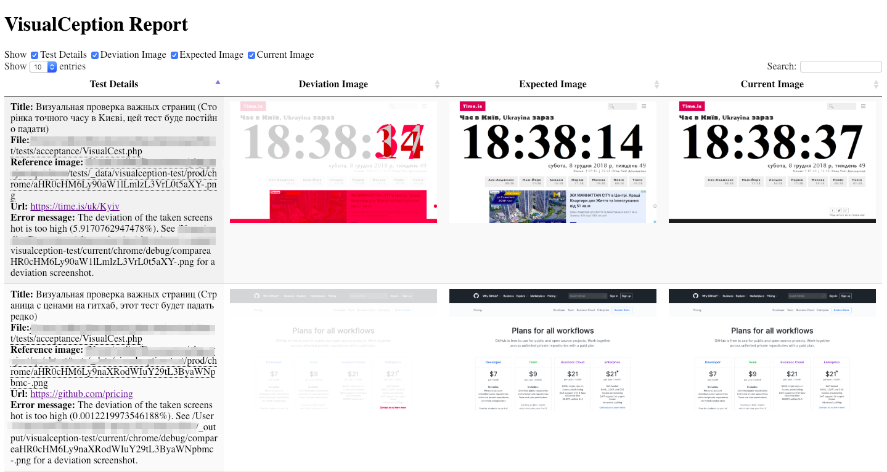

# VisualCeption fork

This is **fork** of [visual regression tests for Codeception](https://github.com/Codeception/VisualCeption).

#### Sample config:
```yaml
modules:
    enabled: 
        - WebDriver:
            url: http://localhost.com
            browser: firefox
        - VisualCeption:
            maximumDeviation: 5                                   # deviation in percent
            saveCurrentImageIfFailure: true                       # if true, VisualCeption saves the current
            fullScreenShot: resize                                # fullpage screenshot (resize/scroll/false)
            referenceImageDir: "/home/qa/img_storage/[browser]/"  # "[browser]" replaced to "firefox"
            currentImageDir: "visualception/current/[browser]/"   # tests/_output/visualception/current/firefox/
            report: true         # tests/_output/vcresult.html
 ```
## Note

Форк делался для себя и под свои запросы, из-за этого не нужно надеятся на его стабильность и безбажность даже для базовых вариантов использования.

#### Изменения:

* Новые пути для сохраниения текущих и эталонных скриншотов, "[browser]" в пути автоматически заменяется на имя браузера
* Новые методы seeVisualChangesInCurrentPage и dontSeeVisualChangesInCurrentPage которым не нужно передавать идентификатор (им выступает урл страницы)
* fullScreenShot: 'resize' - изменяет размер окна браузера на высоту страицы (нужно запускать на виртуальном экране большой высоты)
* Новый шаблон для отчетов
* Возможность удалять элементы со страницы (display:none)
* В отчете не затираются результаты предыдущих запусков

#### Простой пример
 ```php
class VisualCest
{
    /**
     * @env firefox
     * @env chrome
     *
     * @example(url="https://time.is/ru/Kyiv", wantTo="Страница точного времени в Киеве, этот тест будет постоянно падать")
     * @example(url="https://github.com/pricing", wantTo="Страница с ценами на гитхаб, этот тест будет падать редко")
     * @example(url="https://time.is/uk/Kyiv", wantTo="Сторінка точного часу в Києві, цей тест буде постійно падати")
     */
    public function visualTest(\AcceptanceTester $I, \Codeception\Example $example)
    {
        $I->wantTo('Визуальная проверка важных страниц');
        $I->amOnUrl($example['url']);
        $I->dontSeeVisualChangesInCurrentPage(['div#twd'], ['iframe']); // div#twd set style "visibility: hidden;" iframe set "display: none;"
    }
}
 ```

 
